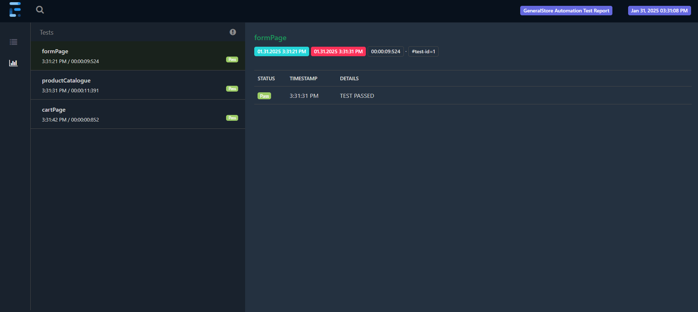
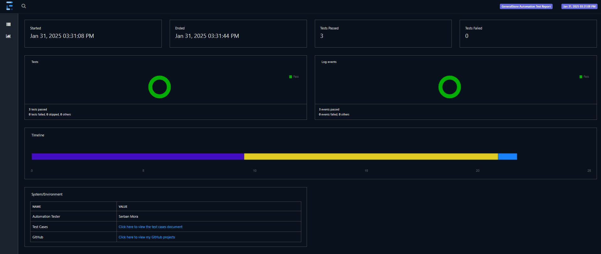

# Appium Project Overview

This personal project is focused on automating test cases for General Store, a demo e-commerce android app, using Appium with the Page Object Model (POM) design pattern and TestNG. It includes various page objects for interacting with different sections of the application, a configuration class for setting up the Android Driver, and test cases for executing the automated tests.

To run the tests, navigate to your project directory and execute the following command:
	```mvn test```, this will trigger Maven to compile the project and run the test cases defined in the project.

* Test Cases execution demo on Android Studio Emulator:
[](https://www.youtube.com/shorts/mGmTriBCuTw)

# Test Cases containing scenarios, steps, automation data, ER/AR and statuses can be found here:
* [Test Cases Spreadsheet Document](https://docs.google.com/spreadsheets/d/1J8PG6RX7NOmLY7BsYBn9He6ZeVsJumMPcQ-YbOtwo8w/edit?pli=1&gid=0#gid=0)

## /AppiumProject/src/main/java/GeneralStore/PageObject
This directory contains the page object classes representing various pages of the application. These classes encapsulate the logic for interacting with page elements (buttons, fields, etc.) and provide methods to perform actions.

* ```AndroidActions.java```: contains methods to perform Android-specific actions.

* ```CartPage.java```: Contains methods for interacting with the cart page.

* ```FormPage.java```: Contains methods for setting up name, country and gender.

* ```ProductCatalogue.java```: Contains methods for interacting with the product catalog page.

## /AppiumProject/src/main/java/GeneralStore/Config
This directory contains configuration files and base test classes needed for setting up the testing environment.

* ```BaseTest.java```: A base test class that initializes the Appium server and AndroidDriver and provides common test setup and teardown methods.

* ```BaseTestUtils.java```: Method to start the Appium server with a specified IP address and port, using a local Appium driver service

* ```ExtentReporter.java```: Configures and generates Extent Reports with a standardized format for test results. 

* ```Listeners.java```: Implements TestNG listeners to track test events and log results into the Extent Report.	

* ```data.properties```: A properties file where you can set the ip address, port, device name, build name and the Appium main JavaScript file main.js path.

## AppiumProject/src/test/java/GeneralStore/TestCases
This directory contains the test case classes responsible for executing the test logic. Each class corresponds to specific scenarios and uses the page objects to carry out the tests.

* ```TestExecution.java```: The main class that contains the execution logic for running the tests. It integrates the page objects and performs actions in sequence to test the application.

## /AppiumProject/REPORTS\index.html
Extent Reports library is used to generate a report document, the ```index.html``` file will be generated with test execution results, including pass/fail status and screenshots for failed tests.

